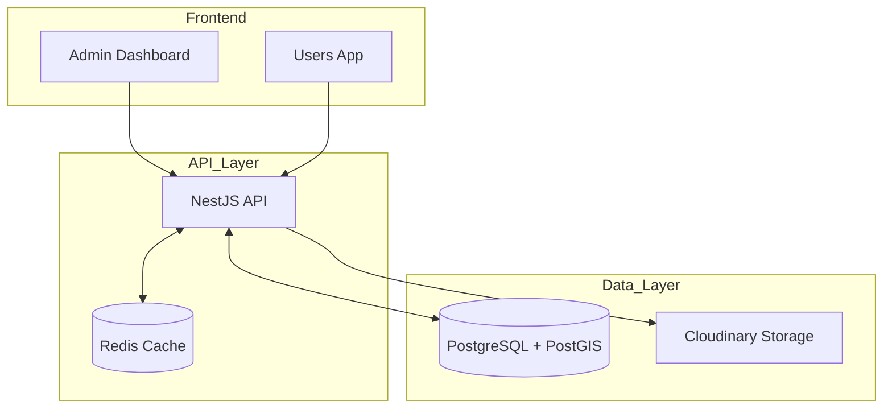

# 🏠 Rental Platform Project

[](https://nestjs.com/)
[](https://nextjs.org/)
[](https://www.prisma.io/)
[](https://www.postgresql.org/)

A comprehensive, high-performance property rental ecosystem consisting of a scalable backend API and multiple specialized frontend applications.

---

## 🎯 Project Goal

This project provides a unified rental marketplace with strict role-based access control (RBAC):

-   **👑 SUPER_ADMIN**: Master account for system oversight, user management, and auditing.
-   **👤 USER**: Registered renters/landlords who can post listings, manage profiles, and chat.
-   **🌐 GUEST**: Public access for browsing map pins and property summaries.

All applications share a centralized **PostgreSQL (PostGIS)** database and **Redis** caching layer to ensure data consistency and performance.

---

## 🤖 For AI Agents

This section provides critical context for AI coding assistants working on this codebase.

### 🏗️ Architecture
-   **Backend**: NestJS (TypeScript). Follows a modular architecture. Core logic resides in `src/`. Uses Prisma as the ORM.
-   **Frontend (Users)**: Next.js 15 (App Router). Located in `/users`. Uses React 19 and Tailwind CSS.
-   **Frontend (Admin)**: Vite + React. Located in `/super-admin-dashboard`.

### 🔑 Key Concepts & Contexts
-   **Localization**: Managed via `LanguageContext.tsx` and `useLanguage` hook. Supports 10 dialects with IP-based auto-detection.
-   **Authentication**: Handled by `AuthProvider.tsx` and `useAuth`. Backend uses JWT + Passport. Token includes `firstName` and `lastName`.
-   **User Model**: Names are split into `firstName` and `lastName`. The `name` field is auto-generated for compatibility.
-   **Real-time**: Socket.io for messaging. Private threads are filtered by `senderId` and `receiverId`.

---

## 🚀 Quick Start (Local)

### Prerequisites
-   **Node.js**: v20+
-   **Docker**: For PostgreSQL, PostGIS, and Redis.
-   **NPM**: v10+

### 1. Infrastructure
```bash
docker-compose -f docker-compose.local.yml up -d postgres redis
```

### 2. Backend
```bash
cd backend
npm install
npx prisma db push
npx ts-node prisma/seed.ts # Seeds 500+ properties in Hanoi
npm run start:dev
```
-   **API**: `http://localhost:3000`
-   **Docs**: `http://localhost:3000/docs` (Swagger)

### 3. Users App
```bash
cd users
npm install
# Windows:
set NEXT_PUBLIC_API_BASE_URL=http://localhost:3000
# Mac/Linux:
export NEXT_PUBLIC_API_BASE_URL=http://localhost:3000
# Run:
npm run dev
```
-   **App**: `http://localhost:3002`

---

## ✨ Features

### 🏢 Backend (`/backend`)
-   **Geospatial Search**: Hyper-fast map queries using PostGIS.
-   **Intelligent Caching**: Redis integration with automatic invalidation.
-   **Background Processing**: BullMQ for async property events.
-   **Audit Logs**: Deep system traces with JSON diffs for property edits.

### 🏠 Users App (`/users`)
-   **IP-Based Localization**: Auto-detects user country and sets language (10 dialects supported).
-   **Onboarding Tour**: Interactive step-by-step guide for first-time visitors.
-   **Rich Profiles**: Custom banners, bios, and listing management.
-   **Interactive Map**: Viewport-based property discovery using Leaflet.
-   **Real-time Chat**: Private messaging with unread indicators, thread history, and mobile-optimized UI.
-   **Accounts Center**: Centralized management for personal info (First/Last Name, Email) and password security.
-   **Name Splitting**: Support for separate First and Last Name fields during registration and in user profiles.

### 🛠️ Admin Dashboard (`/super-admin-dashboard`)
-   **System Oversight**: Real-time metrics on users and properties.
-   **User Management**: Ban/unban users and audit login logs.

---

## 🛠️ Technology Stack

| Layer | Technologies |
| :--- | :--- |
| **Backend** | NestJS, TypeScript, Prisma ORM, PostGIS, Redis |
| **Frontend** | Next.js 15, React 19, Vite, Tailwind CSS, Leaflet |
| **Jobs/Messaging** | BullMQ, Socket.io |
| **Media** | Cloudinary (WebP optimization, public URLs) |
| **Infra** | Docker, Docker Compose, GitHub Actions |

---

## 📐 Architecture Diagram



---

## 🌐 Deployment

Deployment is managed via Docker Compose on a VPS:
1. Copy `.env.production.example` to `.env.production` in root and backend.
2. Fill in production secrets (Cloudinary, DB credentials).
3. Run `docker compose --env-file .env.production up -d --build`.

---

© 2026 Your Home Rental Platform.
